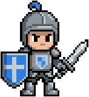

# NanoBridge

[](https://github.com/NspxMiguel/NanoBridge/actions/workflows/tests.yml)

Gemini's **Nano Banana** image generation, wired into agents as an **MCP server**
and a **CLI** — using the Gemini plan the account already has, not a per-image
bill.

```bash
nanobridge sprite "a small knight with a blue shield and a silver sword" --size 160
```

<p align="center">
  
  
</p>

Both of those came out of the commands in this README — the sprite already
trimmed and transparent, the animation already sliced from a sheet and assembled
into a looping GIF.

## Why not just call the API

The AI Studio API key is the obvious route and it does not work on a free plan:
every image model answers `429 RESOURCE_EXHAUSTED`, because the free tier grants
zero image quota. Enabling billing fixes it and starts charging per image, while
the Gemini subscription already sitting on the same account goes unused.

NanoBridge takes the other door: it authenticates as the browser does, with the
`__Secure-1PSID` cookie already in Chrome, and spends the subscription's quota.
Nothing to paste, nothing to buy.

| Backend | Auth | Cost |
| --- | --- | --- |
| `web` (default) | Gemini cookies read from the browser | the plan already paid for |
| `api` (fallback) | `GEMINI_API_KEY` | per image, and needs active billing |

`nanobridge doctor` reports which one is live and how much quota is left.

## There is no login, and no key

The question everyone asks first has an answer nobody guesses: you don't sign in
to anything. NanoBridge reads the Gemini session cookie already sitting in your
browser. If you can open <https://gemini.google.com> and chat, it can generate
images — it is literally the same session.

```bash
nanobridge setup
```

walks it: says that outright, finds the session, opens Gemini if there isn't
one, and proves the whole path by generating a real image rather than claiming
it should work.

There is no GUI, on purpose — there is nothing for one to do. The `api` backend
takes a `GEMINI_API_KEY` and exists only as a fallback for accounts with billing
enabled; on a free tier every image model answers 429.

## Install

```bash
gh repo clone NspxMiguel/NanoBridge ~/Projects/NanoBridge
cd ~/Projects/NanoBridge && ./install.sh
```

The installer builds a virtualenv, puts `nanobridge` on `PATH`, registers the MCP
server with Claude Code, and installs the agent skill. Run it again to upgrade;
it never creates a second `nanobridge` on `PATH`.

Requirements: Python 3.11+, and a browser signed in to
<https://gemini.google.com>.

> This repository is private, so `gh` (authenticated) is the way to clone it and
> there is no Homebrew cask: a cask downloads a source tarball over plain HTTPS,
> which a private repository answers with a 404.

## Use it from the shell

```bash
nanobridge doctor                        # backends, quota, config path
nanobridge sprite "a green slime" --style pixel --size 128
nanobridge icon "a compass rose" --style flat
nanobridge gen "a seamless stone wall texture, top-down, tileable"
nanobridge edit hero.png "make the sky stormy, keep everything else"

nanobridge sheet "a green slime" --grid 4x2 \
  --action "squash down and stretch back up, a bouncy idle loop" --fps 10
```

### A whole cast at once

```bash
nanobridge cast "a knight with a sword" "a hooded rogue" "an old wizard" \
  --size 128 -f godot -f css
```

Generating characters one at a time gives a cast that does not match — the model
picks a slightly different green each time. `cast` generates them together, reads
one palette from the group, locks everyone to it, and packs the result into an
atlas with the manifests you asked for. A subject that fails does not lose the
others.

### Animate a sprite you already have

```bash
nanobridge animate hero.png "raises its sword above its head and lowers it" --grid 4x1
```

The difference between "make an animation of a knight" and "animate **this**
knight". `sheet` does the first — it draws a new character from the text, so the
animation is not the sprite you approved. `animate` sends the sprite along as a
reference and the prompt only describes the movement.

### Several options at once

```bash
nanobridge variations "a treasure chest" -c 4 --palette sweetie16
```

Asking for one image and hoping is the expensive loop. This produces several in
parallel, each pushed in a different direction, and writes a contact sheet — an
agent gets all the options as one image and picks.

### Textures that provably tile

```bash
nanobridge texture "rough cobblestone, mossy cracks" --preview
nanobridge tile floor.png                 # measure any image
nanobridge tile floor.png --repair        # stitch it
```

Models say "seamless" and often are not; the seam only shows up once four copies
sit side by side. NanoBridge measures how far the image jumps when repeated —
against the texture's own internal variation, so a noisy surface is not judged by
the standard of a flat wall — stitches it when it fails, and reports both
numbers. A pure gradient scores 119, a periodic pattern 1.57.

### Normal maps

```bash
nanobridge normal hero.png
```

For 2D dynamic lighting in Godot, Phaser or Unity 2D. Derived from luminance, so
it is not physically correct — a flat bright patch reads as raised — but that is
how most tools do it and it lights a sprite well.

### Palettes

```bash
nanobridge palettes                                   # what is built in
nanobridge sprite "a slime" --palette pico8           # lock to a known palette
nanobridge palette hero.png -n 16 -o game.hex         # take a palette from art
nanobridge sprite "a goblin" --palette game.hex       # and reuse it
nanobridge palette photo.jpg --apply gameboy          # rewrite an existing file
```

Built in: `pico8`, `gameboy`, `gameboy-pocket`, `cga`, `c64`, `sweetie16`,
`endesga32`, `grayscale8`. Anywhere a palette is accepted you can also pass a
`.hex` file (one `#RRGGBB` per line) or an inline `#RRGGBB,#RRGGBB` list.

Matching is perceptual, not raw RGB. It has to be: in plain RGB the grey
`#5F574F` is closer to a mid green than PICO-8's own green is, so a green slime
came out grey.

### Real pixel art

```bash
nanobridge sprite "a slime" --pixels 32 --zoom 8
nanobridge cut art.png --pixels 48 --zoom 6 --palette pico8
```

`--size` scales the image; `--pixels` rebuilds it at an exact number of art
pixels, so the grid closes and every art pixel is one pixel. `--zoom` then scales
back up by a whole number, grid intact. Downscaling from 2816px straight to 128px
gives blocks of 4, 5 and 6 pixels mixed together — it reads as pixel art until
somebody zooms in.

Sheets are generated, sliced into frames, and assembled into a looping GIF with
the transparency preserved — GIF has no alpha channel, so a palette index is
reserved for the empty pixels.

Three commands never touch the network, so they cost no quota and work on
images from anywhere:

```bash
nanobridge cut photo.jpg --transparent --trim --size 256
nanobridge slice sheet.png --grid 6x1 --size 96
nanobridge atlas hero.png villain.png item.png -o game/atlas
```

`atlas` is the gap between "I generated some sprites" and "the game can draw
them": one sheet plus a JSON manifest of where each named sprite sits — what
Godot, Phaser and Unity call a sprite atlas. `--dir` packs a whole folder
instead of naming files one by one.

## Use it from an agent

The MCP server exposes `generate_cast`, `generate_sprite`, `animate_sprite`,
`generate_variations`, `generate_texture`, `generate_sprite_sheet`,
`generate_image`, `generate_icon`, `edit_image`, `cut_image`, `slice_sheet`,
`pack_atlas`, `build_normal_map`, `check_tileable`, `repair_tileable`,
`list_atlas_formats`, `list_palettes`, `extract_palette`, `apply_palette`,
`nanobridge_status` and `nanobridge_reset`.

`generate_cast` is the one to reach for when the task is "a set of characters"
rather than one image — it is the whole coherence story in a single call.

Every generating tool returns the image **back to the model**, downscaled to a
512px preview, alongside the paths on disk. That is the point: an agent that
cannot see what it drew cannot tell a good sprite from a broken one, and iterates
blind.

Registering it by hand:

```bash
claude mcp add nanobridge --scope user -- /path/to/.venv/bin/nanobridge mcp
```

## What the post-processing does

The model returns a large JPEG on a flat background. Sprites need the opposite,
so the pipeline is part of the tool rather than an afterthought:

- **Background removal is border-connected**, not colour-matched. A white eye
  inside a sprite has the same colour as the white behind it; only the region
  that reaches the image border is erased.
- **Trim** crops to the drawing.
- **Resize is nearest-neighbour.** Pixel art resampled with a smooth filter stops
  looking like pixel art.
- **Slicing is geometric.** The grid asked for in the prompt is the grid used to
  cut, and the individual frames are written out — that is where you see whether
  the model actually obeyed.
- **Palette matching is perceptual**, and resizing is premultiplied so a sprite
  edge does not pick up a halo from whatever was behind it.

## Languages

Screen text is Portuguese and English. The system locale picks the default,
`nanobridge lang pt|en` saves a choice, and `NANOBRIDGE_LANG=pt` overrides both
for one run.

## Limits worth knowing

- The web backend depends on a browser session. When it expires, sign in again at
  <https://gemini.google.com>; `nanobridge doctor` says so explicitly.
- It talks to an interface Google does not document, so a change on their side can
  break it. The `api` backend is the fallback that stays put.
- Generated images carry Google's SynthID watermark.

## Getting good output

[`PROMPTING.md`](PROMPTING.md) is the guide: which tool fits which ask, why
naming what you *don't* want matters more than describing what you do, how to
write an animation action that actually loops, and what to do when the output is
wrong. The agent skill carries a condensed version, so an agent using the MCP
server already knows it.

## Credit

NanoBridge is not the only project that reaches Nano Banana through a browser
session — [gemini-webapi-mcp](https://github.com/AndyShaman/gemini-webapi-mcp)
by [AndyShaman](https://github.com/AndyShaman) got there first, in February
2026, on the same idea and largely the same stack
([gemini-webapi](https://github.com/HanaokaYuzu/Gemini-API) +
`browser-cookie3` + `mcp`). Two things here exist because that project showed
they were worth having:

- `NANOBRIDGE_COOKIE_FILE` — point at a browser cookie store outside the default
  location, for a profile that lives somewhere unusual.
- `nanobridge_reset` — drop a stale session on purpose, right after signing back
  in to Gemini, instead of waiting for the next generation to fail and report it.

What NanoBridge does that it does not: the sprite pipeline (border-connected
background removal, sheet slicing, GIF assembly with a transparent palette
index), the prompt templates for sprite/icon/sheet, a CLI with subcommands
alongside the MCP server, and Portuguese as a first-class language throughout.
What it does that NanoBridge does not: 2x upscale via a dedicated RPC (though
`gemini-webapi` already fetches full-size images by a different route — see
[Limits worth knowing](#limits-worth-knowing)), watermark removal, video/URL
analysis, and open-ended text chat.

## License

AGPL-3.0-or-later. This is not the default choice — it's inherited: NanoBridge
imports `gemini-webapi`, which is AGPL-3.0, and a program that imports an AGPL
library and is distributed has to carry compatible terms for the combined work.
The practical consequence for a user running NanoBridge unmodified: none. It
only binds someone who modifies NanoBridge and runs the modified version as a
network service for others — they have to offer that modified source.
