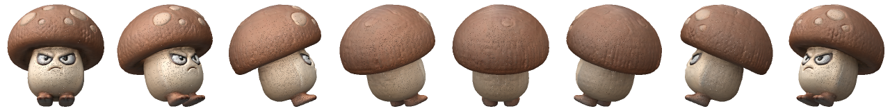
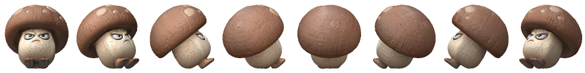

# One mushroom, eight directions

Everything in `assets/` came out of NanoBridge. Nothing was drawn, retouched or
posed by hand.

<p align="center">
  
</p>

## The one command

```bash
nanobridge sprite3d "a round brown mushroom enemy with big angry eyes and small feet, cartoon game character" \
  --frames 8 --size 160 --pitch 15 --gif
```

That is three models in a row:

| Step | Who | What came out |
| --- | --- | --- |
| 1. reference | Nano Banana, via the Gemini plan | `referencia.jpg` |
| 2. reconstruction | TripoSR (MIT), free public Space | `goomba.glb` — 142 791 vertices, 285 267 faces |
| 3. render | a NumPy rasteriser in this repo | `frames/`, `folha.png`, `volta.gif` |

## Or the same thing in three commands

The split exists because step 1 is the one that goes wrong — a cropped
character, two characters, a floor sneaking into the background — and redoing
only that step is far cheaper than redoing the chain.

```bash
nanobridge gen "3D render of a round brown mushroom enemy ..." -o work/
nanobridge mesh work/mushroom.jpg --name goomba
nanobridge turntable goomba.glb --frames 8 --pitch 30 --gif
```

`--pitch` is the camera tilt, and it is the setting that decides whether the
sprite fits the game it was drawn for:

| | |
| --- | --- |
| `--pitch 0` | side-on, for a platformer |
| `--pitch 15` | the default — shows the top of the shoulder without flattening the silhouette |
| `--pitch 30` | proper isometric, looking down (`folha-isometrica.png`) |

<p align="center">
  
</p>

## What is worth noticing in these files

**The mushroom is the same size in all eight frames.** Framing each view on its
own would look better one frame at a time and be wrong in motion: a character is
wide from the front and narrow from the side, so it would swell and shrink as it
turned. The framing is measured once, across the union of every angle.

**The frames are ordinary PNGs with an alpha channel.** `pack_atlas`,
`apply_palette` and `slice_sheet` all work on them, so a reconstructed mesh can
become four-colour pixel art:

```bash
nanobridge turntable goomba.glb --frames 8 --palette gameboy --pixels 48
```

**Rendering runs offline.** Step 3 touches no network and no GPU — clone this
folder and `nanobridge turntable assets/goomba.glb` re-renders every frame here
from the mesh, byte for byte.

## The honest boundary

Nano Banana returns pixels. It does not return meshes, and no prompt will make
it. The geometry in `goomba.glb` came from TripoSR, a different model in a
different family, and it is real geometry — open it in Blender, or in any
`.glb` viewer, and rotate it.

The reference is what decides whether that works. It needs one object, whole,
facing the camera, on a plain background, with visible shading. Flat pixel art
does not reconstruct: measured on this repo's own 32×32 hero sprite, TripoSR
returned a slab 7% as deep as it was wide. `nanobridge mesh` prints a
`depth_ratio` for exactly this reason and warns below 0.1 — here it was **0.918**.

`goomba.glb` is 5.7 MB, which is what an unsimplified reconstruction weighs. A
game would decimate it; this folder keeps it whole because it is the proof.
